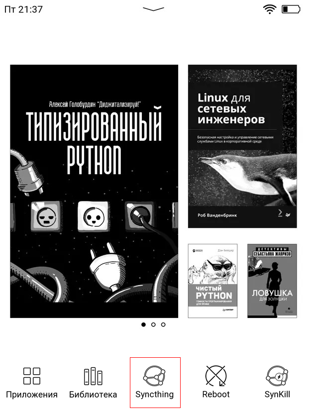
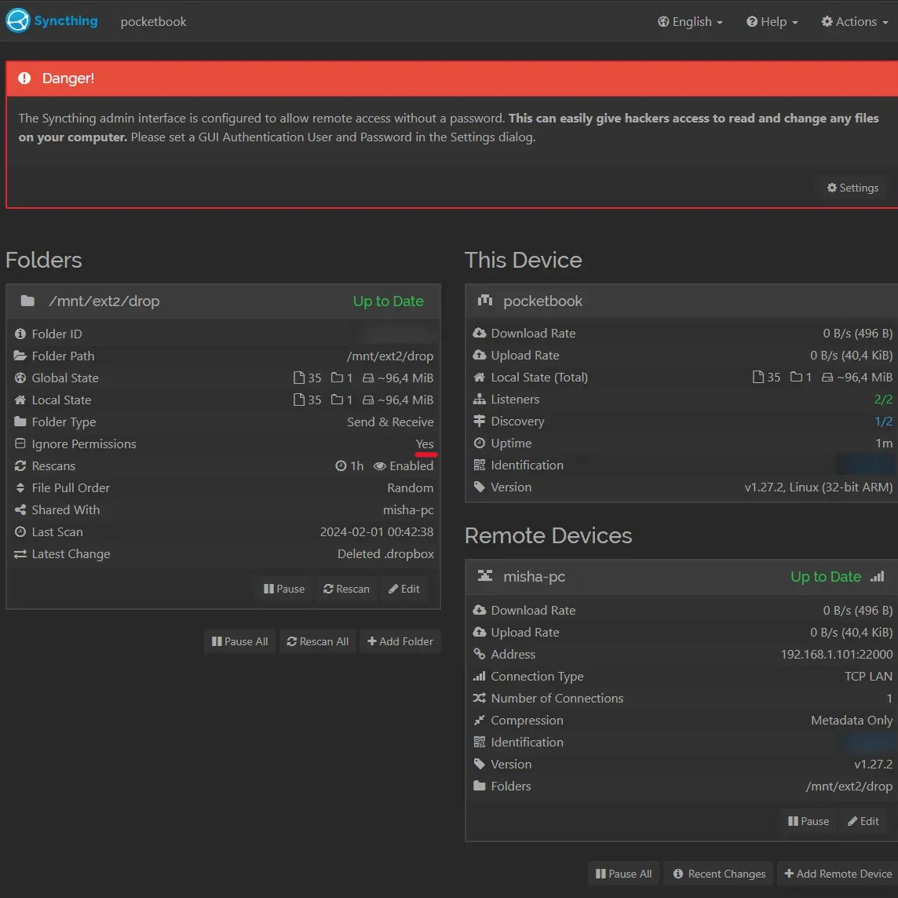

<p align="right">
  <a href="https://github.com/syncthing/syncthing/releases/latest">
    
  </a>
  <a href="https://github.com/mikedigriz/Syncthing-for-PocketBook/blob/main/docs/SCRIPTS.en.md">
    
  </a>
  <a href="https://github.com/mikedigriz/Syncthing-for-PocketBook/blob/main/README.en.md">
    
  </a>
    <a href="https://github.com/mikedigriz/Syncthing-for-PocketBook/blob/main/README.md">
    
  </a>
</p>

[](https://syncthing.net/)
## Launch [Syncthing](https://syncthing.net/) on PocketBook 
**Tested:** PB740 (InkPad 3) v6.8.4473, Syncthing 2.1.1, Linux (32-bit ARM)

Also works on:
- PocketBook 700 Era Color (PB700K3)
- PocketBook 650, check [issue #6](https://github.com/mikedigriz/Syncthing-for-PocketBook/issues/6)

Syncthing keeps your books and documents in sync between your PocketBook
and your other devices (computer, smartphone) over the internet or a local network.
Your data stays entirely yours and is stored only on your own devices.

## Installation

1. On the [Syncthing releases page](https://github.com/syncthing/syncthing/releases/latest),
   find the file named `syncthing-linux-arm-v2.*.*.tar.gz`, download it,
   and take just the `syncthing` binary (~24 MB) out of the archive,
   the rest is not needed.

2. Create the folder `ext1\applications\syncthing` and put there:
   - the `syncthing` binary
   - the config [*config.xml*](https://github.com/mikedigriz/Syncthing-for-PocketBook/blob/main/config.xml)

3. Put [*syncthing.app*](https://github.com/mikedigriz/Syncthing-for-PocketBook/blob/main/syncthing.app)
   into `ext1\applications`.


```
│── applications
|    │── syncthing
|    │   │── syncthing
|    │   └── config.xml
|    │
|    │── icons
|    │   │── syncthing_app_f.bmp
|    │   └── syncthing_app.bmp
|    │
|    └── syncthing.app
```

### Changing the Icon

> [!IMPORTANT]\
> Do this [step](https://github.com/jjrrw174/PocketBook-Desktop-and-App-Customizations/tree/16ae9294fafe287319311cca4e97675d66606a1d?tab=readme-ov-file#adding-custom-app-icons-images)
> only if you have made a backup of the file being modified.

Change file [*view.json*](https://github.com/mikedigriz/Syncthing-for-PocketBook/blob/main/view.json)
of your device and copy the icons

<details> <summary>It should look like this:</summary>
 <p align="center">
    
</p>

ROOT is not needed. The `system` folder with `view.json` is hidden,
and turning on hidden files differs from one OS to another:
- Windows (Explorer): View tab → Show → Hidden items.
- macOS (Finder): press `Cmd + Shift + .` (period).
- Linux (most file managers): press `Ctrl + H`.

Entries `U_syncthing` and `U_syncthing_kill` have been added to
`ext1\system\config\desktop\view.json`:

Between "applications" and "_comment":
```json
    "applications": {
        "U_syncthing": {
			"path": "/mnt/ext1/applications/syncthing.app",
			"title": "Syncthing",
			"icon": "/mnt/ext1/applications/icons/syncthing_app.bmp",
			"focused_icon": "/mnt/ext1/applications/icons/syncthing_app_f.bmp"
		},
        "U_syncthing_kill": {
			"path": "/mnt/ext1/applications/syncthing_kill.app",
			"title": "Stop Syncthing",
			"icon": "/mnt/ext1/applications/icons/syncthing_kill_app.bmp",
			"focused_icon": "/mnt/ext1/applications/icons/syncthing_kill_app_f.bmp"
		},
        "_comment":
 ```

In Services section:
```json
            {
                "title": "@Services",
                "sort": "title",
                "apps": [
                    "PB_Dropbox",
                    "PB_Cloud",
                    "PB_SendToPB",
                    "U_syncthing",
                    "U_syncthing_kill"
                ]
            },
```

Copied the icons syncthing_app.bmp, syncthing_app_f.bmp,
syncthing_kill_app.bmp, syncthing_kill_app_f.bmp to
`ext1\applications\icons\`

</details> 

## Using

Launch Syncthing. The first launch takes about 20 seconds after you tap `OK`.
After that it runs in the background and stays out of your way until you turn
it off. New files appear on the main page after the device is restarted.
Or try the experimental [*syncthing_kill.app*](https://github.com/mikedigriz/Syncthing-for-PocketBook/blob/main/syncthing_kill.app).

From here it's [the same as on any other device with Syncthing](https://docs.syncthing.net/intro/getting-started.html):

1. Open `http://your-ip-address:8384` in a browser. You can find the reader's IP
   in the connected Wi-Fi network details (for example: long-press the network,
   then "Information").
2. Set up the folder and enable "ignore permissions".


<details> <summary>Example of settings from the web panel</summary>
<p align="center">
    
</p>
</details> 

## For Pro (advanced script)

This one is for people who already figured out the regular
[*syncthing.app*](https://github.com/mikedigriz/Syncthing-for-PocketBook/blob/main/syncthing.app)
and have it running reliably. If the basic script isn't set up yet,
get that working first and come back later.

The regular script does exactly one thing: it starts syncthing.
[*syncthing_pro.app*](https://github.com/mikedigriz/Syncthing-for-PocketBook/blob/main/syncthing_pro.app)
does a bit more.

What's nicer about it:
- Tap it, it starts. Running? Tap it, it shows the status.
- The status shows what matters: whether it's syncing, when it last synced,
  how many files are already in place, and whether there are any errors.
- It opens quicker and the screen doesn't flash on every tap.

The status looks like this:

```
Sync error
459 of 640 MB (72%)
Notes: error (3)
Inbox: syncing (5/40)
Archive: paused
New: starting
```

Breaking it down:
- **Status line** (e.g. `Sync error`) - the headline. Could be `Up to date`,
  `Syncing...`, or `Sync error` if something went wrong.
- **Progress** (e.g. `459 of 640 MB (72%)`) - synced across all folders combined:
  how much / total size (percent).
- **Folder details** - only the ones with issues or paused:
  - `Notes: error (3)` - a folder with errors, 3 files stuck.
  - `Inbox: syncing (5/40)` - currently syncing, done 5 of 40 files.
  - `Archive: paused` - you paused this one.
  - `New: starting` - folder is initializing.

Healthy folders stay hidden to keep the dialog clean.

How to switch:

1. Copy [*syncthing_pro.app*](https://github.com/mikedigriz/Syncthing-for-PocketBook/blob/main/syncthing_pro.app)
   to `ext1\applications`. Either in place of the regular one, or next to it
   with another entry in `view.json`.
2. Stop syncthing and edit the `gui` section in
   `ext1\applications\syncthing\config.xml`:

```xml
    <gui enabled="true" tls="false" sendBasicAuthPrompt="false">
        <address>/tmp/syncthing.sock</address>
    </gui>
```

3. Stop syncthing only with [*syncthing_kill.app*](https://github.com/mikedigriz/Syncthing-for-PocketBook/blob/main/syncthing_kill.app).

> [!WARNING]\
> On launch `syncthing_pro.app` takes a lock, and only `syncthing_kill.app`
> releases it. So stop it only with that app. If you stop it any other way
> (turning off Wi-Fi, say), the lock stays behind and the next tap on
> `syncthing_pro.app` silently does nothing until you reboot the device.
> See the [Lock](docs/SCRIPTS.en.md#the-lock) section for details.

After this edit the web panel at `http://your-ip-address:8384` will stop
opening, so set up all your folders beforehand. To get the panel back,
put the address `0.0.0.0:8384` back.

## Synchronizing reading progress

The [Koreader](https://github.com/koreader/koreader) reader will help
in this task. Each open book has its own directory with the necessary
lua-files, which makes it possible to read between devices.

## Not working?

**The web panel won't open in the browser.** Check that Wi-Fi is on and the
computer is on the same network as the reader, and that the address is exactly
`http://<reader-IP>:8384` (no https). From a computer you can test the connection
with `curl http://<reader-IP>:8384`, and the error code shows up in the browser
under F12 → Network. If you switched to Pro and `config.xml` points to
`/tmp/syncthing.sock`, the panel is disabled on purpose, that is not a fault.

**How to stop syncthing and save battery.** It doesn't appear in the app list
because it runs in the background. Stop it with
[*syncthing_kill.app*](https://github.com/mikedigriz/Syncthing-for-PocketBook/blob/main/syncthing_kill.app)
(which also refreshes the library) or by restarting the device. Wi-Fi turns on
at start and off on stop by itself, so the network won't drain the battery
while idle.

## Links

[Install Syncthing on PocketBook](https://blog.tastytea.de/posts/syncthing-on-pocketbook/)

[Convert to 8bit bmp icon](https://gist.github.com/mikedigriz/6830eaaedcbba99afbe216c3d9195c06)

Special thanks to [the forum](https://forum.syncthing.net/t/pls-release-a-version-for-pocketbook/21370/) for the additions!
