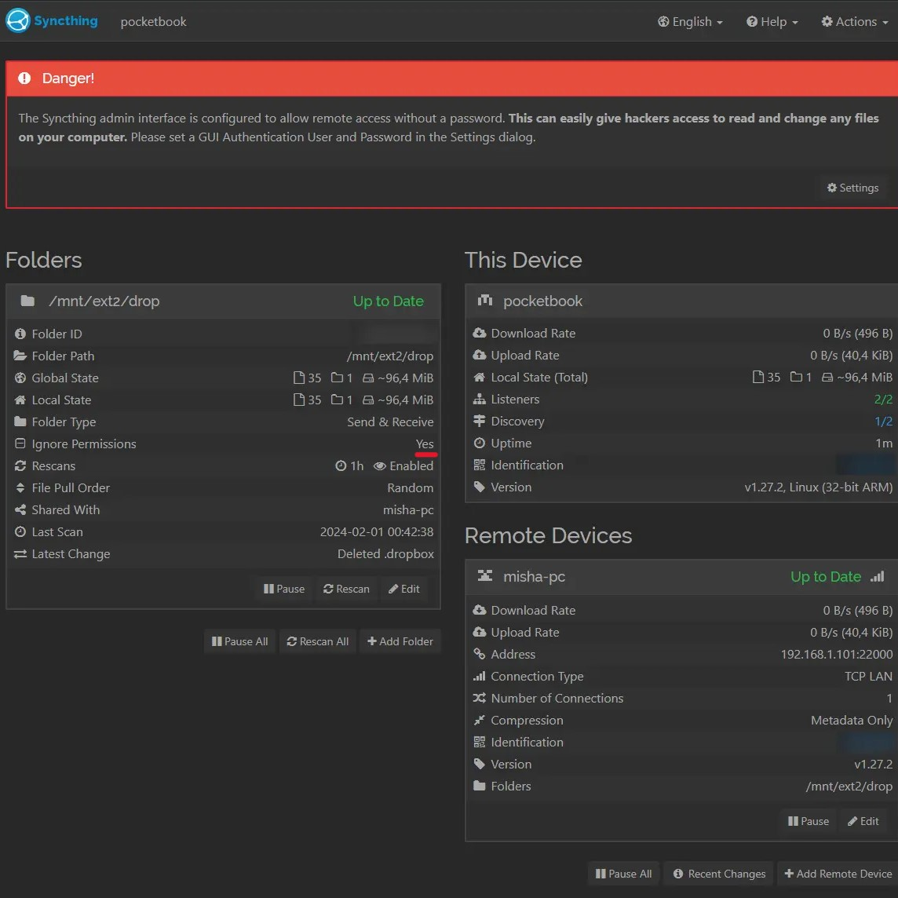
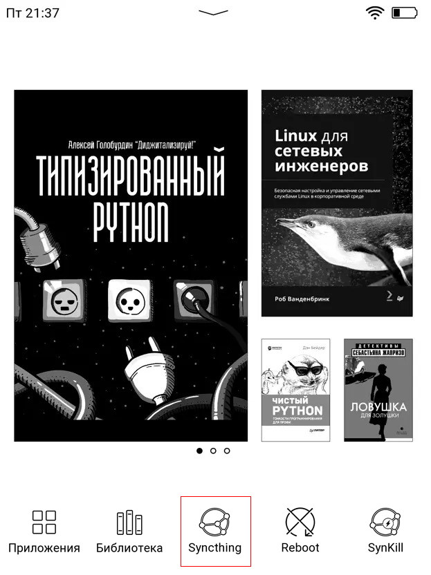

# Syncthing-for-PocketBook
Launch [Syncthing](https://syncthing.net/) on PocketBook 

    

Протестировано на PB740 
Версия ПО U740.6.5.1379 
Версия Syncthing v1.27.2, Linux (32-bit ARM)

## Установка

- Создать папку *syncthing* во внутренней памяти `ext1\applications\syncthing`

- Скопировать конфиг *config.xml* в `ext1\applications\syncthing`

- Скопировать *syncthing.app* в `ext1\applications`

- Скачать версию [Linux 32-bit ARM](https://github.com/syncthing/syncthing/releases/download/v1.27.2/syncthing-linux-arm-v1.27.2.tar.gz)

- Извлечь в созданную папку `ext1\applications\syncthing\` бинарь - *syncthing* (24mb размер)

### Настройка иконки

Делайте этот [шаг](https://github.com/jjrrw174/PocketBook-Desktop-and-App-Customizations?tab=readme-ov-file#adding-custom-app-icons-images) только если уверены и сделали бэкап изменяемых файлов. 
Нужно аккуратно отредактировать *view.json* вашего устройства и скопировать *icons*

 
Должно получиться так:

 

    

 

 

## Примечания
Чтобы все заработало после включения нужно врубить вай-фай и запустить приложение @syncthing.  Далее оно будет работать незримо. Чтобы папки подцепились нужно задать игнорирование прав.  Подробнее в ссылке ниже.

## Ссылки

[Install Syncthing on PocketBook](https://blog.tastytea.de/posts/syncthing-on-pocketbook/)

[Root for PB740](https://www.mobileread.com/forums/showthread.php?t=325185)

[PocketBookTerminal](http://users.physik.fu-berlin.de/~jtt/PB/)

[Create 8bit bmp icon for PocketBook](https://gist.github.com/mikedigriz/6830eaaedcbba99afbe216c3d9195c06)
