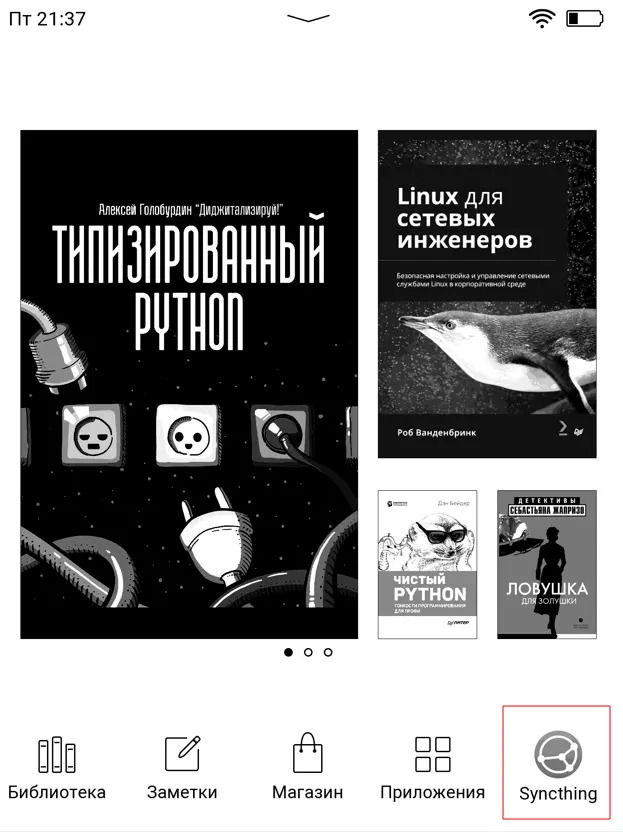

[](https://syncthing.net/)
## Launch [Syncthing](https://syncthing.net/) on PocketBook 
Протестировано на PB740<br>
Версия ПО U740.6.8.2461<br>
Версия Syncthing v1.27.6, Linux (32-bit ARM)

## Установка

- Создать папку *syncthing* во внутренней памяти `ext1\applications\syncthing`

- Скопировать конфиг [*config.xml*](https://github.com/mikedigriz/Syncthing-for-PocketBook/blob/main/config.xml) в `ext1\applications\syncthing`

- Скопировать [*syncthing.app*](https://github.com/mikedigriz/Syncthing-for-PocketBook/blob/main/syncthing.app) в `ext1\applications`

- Скачать версию [Linux 32-bit ARM](https://github.com/syncthing/syncthing/releases/download/v1.27.6/syncthing-linux-arm-v1.27.6.tar.gz)

- Извлечь в созданную папку `ext1\applications\syncthing\` бинарь - *syncthing* (25mb размер)


```
│── applications
|    │── syncthing
|    │   │── syncthing
|    │   └── config.xml
|    │
|    │── icons
|    │   │── syncthing_app_f.bmp
|    │   └── syncthing_app.bmp
|    │
|    └── syncthing.app
```

### Настройка иконки

Делайте этот [шаг](https://github.com/jjrrw174/PocketBook-Desktop-and-App-Customizations/tree/16ae9294fafe287319311cca4e97675d66606a1d?tab=readme-ov-file#adding-custom-app-icons-images) только если уверены и сделали бэкап изменяемых файлов.<br>
Нужно аккуратно дописать [*view.json*](https://github.com/mikedigriz/Syncthing-for-PocketBook/blob/main/view.json) вашего устройства и скопировать *icons*

<details> <summary>Должно получиться так:</summary>
 <p align="center">
    
</p> 
ROOT не нужен. Системные папки скрыты.
	
Добавлены 2 записи U_syncthing в `/system/config/desktop/view.json`

Между "applications" и "_comment":
```json
    "applications": {
        "U_syncthing": {
			"path": "/mnt/ext1/applications/syncthing.app",
			"title": "Syncthing",
			"icon": "/mnt/ext1/applications/icons/syncthing_app.bmp",
			"focused_icon": "/mnt/ext1/applications/icons/syncthing_app_f.bmp"
		},
        "_comment":
 ```

В секцию Services:
```json
            {
                "title": "@Services",
                "sort": "title",
                "apps": [
                    "PB_Dropbox",
                    "PB_Cloud",
                    "PB_SendToPB",
                    "U_syncthing"			
                ]
            },
```

Скопированы иконки syncthing_app.bmp, syncthing_app_f.bmp в `/mnt/ext1/applications/icons/`

</details> 

## Использование

После включения устройства нужно включить вай-фай и запустить приложение Syncthing. Далее оно будет работать незримо до выключения. Новые файлы будут видны на главной странице после перезагрузки устройства.

*Здесь все так же как и на других устройствах с Syncthing*
- Открыть в браузере адрес: `http://your-ip-address:8384`
- Настроить папку, задать игнорирование прав


<details> <summary>Пример настроек из веб-панели</summary>
<p align="center">
    
</p>
</details> 

### Синхронизация прогресса чтения
В этой задаче поможет читалка [Koreader](https://github.com/koreader/koreader).

К каждой открытой книге создается своя директория с нужными lua-файлами, что дает возможность чтения между устройствами.

## Ссылки

[Install Syncthing on PocketBook](https://blog.tastytea.de/posts/syncthing-on-pocketbook/)

[Root for PB740](https://www.mobileread.com/forums/showthread.php?t=325185)

[Convert to 8bit bmp icon](https://gist.github.com/mikedigriz/6830eaaedcbba99afbe216c3d9195c06)

Отдельное спасибо [форуму](https://forum.syncthing.net/t/pls-release-a-version-for-pocketbook/21370/) за дополнения!
